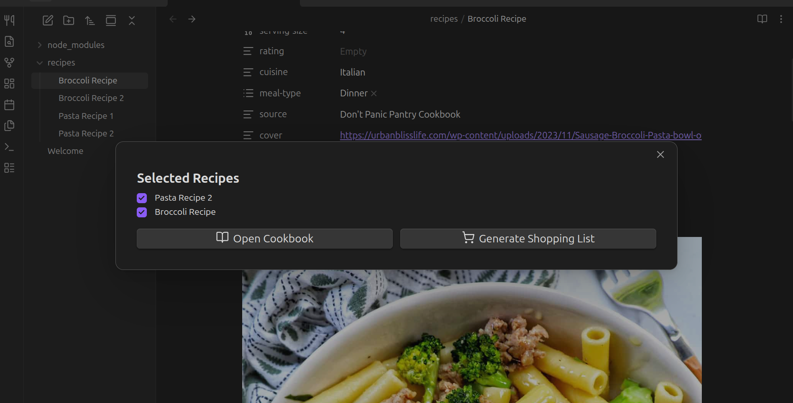
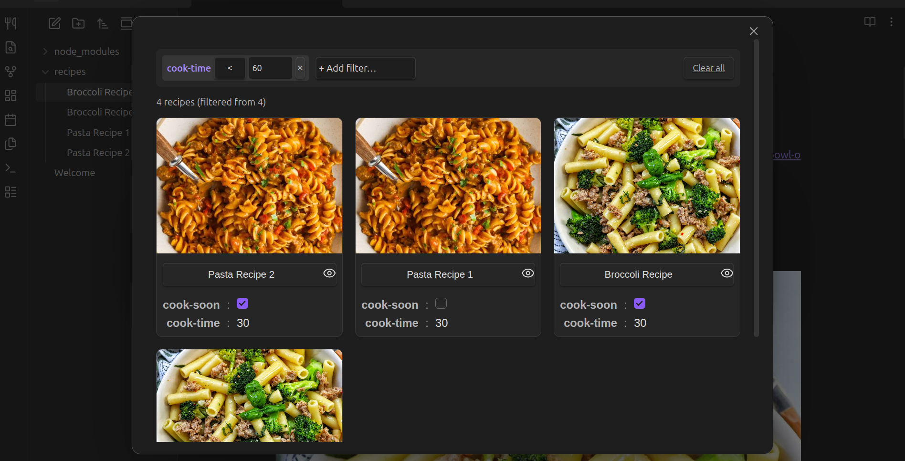
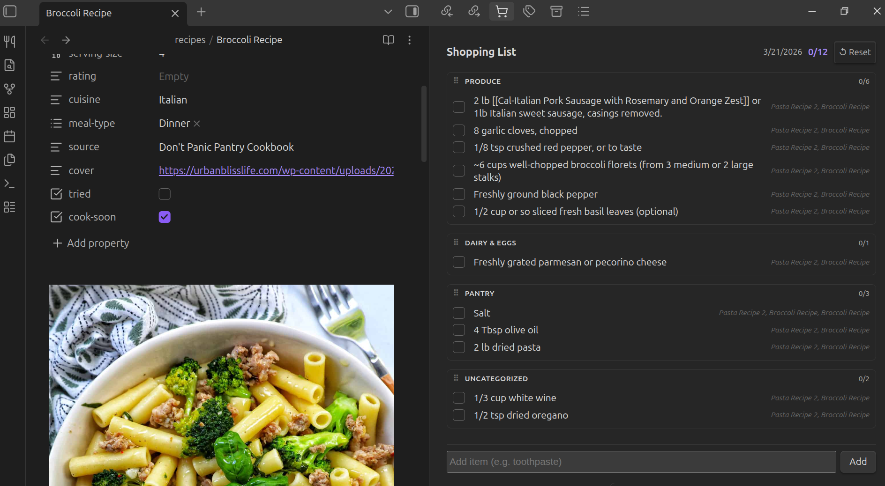

# Cookbook

An [Obsidian](https://obsidian.md) plugin to browse your recipe notes, filter them by frontmatter properties, and generate categorised shopping lists.

## Features

- **Recipe grid** — view all your recipe notes in a card layout with cover images and frontmatter fields
- **Filters** — filter recipes by any frontmatter property; supports string matching and numeric comparisons (`<`, `=`, `>`)
- **Ingredient filters** — filter recipes by ingredient with autocomplete; supports "must contain" and "excludes" with AND/OR logic
- **Dietary group filters** — one-click filters for named ingredient groups (Dairy, Gluten, Nuts, etc.); fully customisable
- **Cook soon** — flag recipes you plan to make this week
- **Serving multiplier** — scale any recipe before generating the shopping list (×2, ×3, etc.) directly from the recipe card, detail view, or ribbon menu
- **Shopping list** — generate a categorised, grouped shopping list from your cook-soon recipes
- **Smart ingredient parsing** — quantities, units, and fractions are extracted automatically; ingredients are aggregated across recipes with unit-aware conversion
- **Custom items** — add one-off items to the shopping list manually; items are auto-categorised by keyword
- **Drag to reorder** — rearrange shopping list categories by dragging
- **Recipe detail** — click any recipe card to read the full note rendered inside Obsidian

## How It Works

Cookbook reads notes in your vault and treats any note tagged `#recipe` (configurable) as a recipe. Frontmatter properties are used for display and filtering.

### Example recipe note

Ingredients are read from **checkboxes** (`- [ ]`) anywhere in the note body. Each checkbox line becomes one shopping list item.

```markdown
---
tags: [recipe]
title: Spaghetti Bolognese
cook-time: 45
servings: 4
cover: https://example.com/bolognese.jpg
---

## Ingredients

- [ ] 2 cloves garlic
- [ ] 500g beef mince
- [ ] 1 tin chopped tomatoes
- [ ] 200g spaghetti
- [ ] olive oil

## Steps

Your steps here...
```

Both unchecked `[ ]` and already-checked `[x]` boxes are picked up — the checked state in your note does not affect the shopping list.

#### Quantities and units

The plugin parses quantities and units from the start of each ingredient line. Supported formats:

```text
- [ ] 2 cups flour            →  2 cups flour
- [ ] 1/2 tsp salt            →  1/2 tsp salt
- [ ] 1 1/2 cups milk         →  1 1/2 cups milk
- [ ] 100g butter             →  100 g butter
- [ ] 2-3 cloves garlic       →  2 cloves garlic  (takes lower of range)
- [ ] ~6 cups broccoli        →  6 cups broccoli  (strips ~ marker)
- [ ] olive oil               →  olive oil        (no quantity)
```

Recognised units include: `tsp`, `tbsp`, `cup/cups`, `pt`, `qt`, `gal`, `ml`, `l`, `fl oz` (volume) and `g`, `kg`, `oz`, `lb/lbs` (weight).

#### Serving multiplier

Each cook-soon recipe has a `− ×1 +` stepper available on the recipe card, in the detail view, and in the ribbon menu. Setting a recipe to ×2 doubles all its quantities in the generated shopping list.

#### Aggregation across recipes

When you generate a shopping list from multiple cook-soon recipes, identical ingredients (matched case-insensitively) are **merged into a single line**:

- **Same unit** — quantities are summed directly (`1 cup flour` + `2 cups flour` = `3 cups flour`)
- **Different units, same type** — converted to a common base and summed (`1 cup milk` + `4 tbsp milk` ≈ `1 1/4 cups milk`)
- **Incompatible units** (e.g. cups vs grams) — kept as separate entries
- **No unit** — aggregated by name only
- The source recipe titles are **combined** and shown as a label under the item so you know where it came from

Items that cannot be matched to a category fall into **Uncategorized** at the bottom of the list.

### Filtering recipes

The recipe browser supports multiple filter types that can be combined:

**Frontmatter filters** — filter by any property on your recipe notes. String properties use exact match; numeric properties support `<`, `=`, `>`.

**Ingredient filters** — search for recipes that must contain (or exclude) a specific ingredient. Type to get autocomplete suggestions drawn from your actual recipe notes. Multiple ingredients can be added to a single filter, with an AND/OR toggle to control how they combine.

**Dietary group filters** — pre-built groups let you filter by broad ingredient categories with a single click:

| Group | Examples |
| --- | --- |
| Dairy | milk, butter, cream, cheese, yogurt… |
| Meat & Poultry | chicken, beef, pork, bacon, lamb… |
| Fish & Seafood | salmon, tuna, shrimp, cod, prawn… |
| Eggs | egg, eggs |
| Nuts | almond, walnut, cashew, peanut… |
| Gluten | flour, wheat, bread, pasta, barley… |

Groups are fully editable in settings — rename them, add keywords, or create your own. You can also use frontmatter flags on individual recipes (e.g. `isVegan: true`) and filter on those directly using the frontmatter filter.

### Using the plugin

1. Click the **utensils icon** in the ribbon to open the quick-access menu
2. Select **Browse recipes** to browse and filter your recipes
3. Mark recipes as **Cook soon** using the checkbox on each card or in the detail view
4. Optionally adjust the **serving multiplier** (`− ×1 +`) on any cook-soon recipe to scale its quantities
5. Back in the ribbon menu, click **Generate Shopping List** to build a shopping list from your cook-soon recipes
6. The **Shopping List** panel opens in the right sidebar — check off items as you shop

**Ribbon menu** — shows your cook-soon recipes and quick actions:



**Recipe browser** — filter and browse your recipes in a card grid:



**Shopping list** — categorised ingredients from your cook-soon recipes:



## Commands

| Command | Description |
| --- | --- |
| **Browse recipes** | Opens the recipe browser |
| **Open shopping list** | Opens the shopping list sidebar panel |

## Settings

### Properties to display

A comma-separated list of frontmatter properties to show on each recipe card (e.g. `title, cook-time, servings, cover`).

### Recipes folder

Restrict recipe scanning to a specific folder. Defaults to the entire vault.

### Recipes tag

The tag that identifies a note as a recipe. Defaults to `#recipe`.

### Cook-soon property

The frontmatter key used to mark a recipe as cook-soon. Defaults to `cook-soon`. Change this if your vault already uses a different key.

### Ignore paths

A list of folders or files to exclude from recipe scanning. Useful for template folders or example notes.

### Hide checked items

When enabled, checking off a shopping list item removes it from the list immediately instead of showing a strikethrough. Useful for a cleaner shopping experience.

### Preferred volume unit / preferred weight unit

Choose which unit to use when displaying aggregated volume or weight quantities on the shopping list (e.g. prefer `cups` over `ml`). Defaults to auto, which uses whichever unit appears first.

### Ingredient groups

Named groups of ingredient keywords used by the dietary group filters in the recipe browser. Six groups are pre-configured (Dairy, Meat & Poultry, Fish & Seafood, Eggs, Nuts, Gluten). You can add your own groups, edit the keywords, or remove groups you don't need.

### Shopping list categories

Keyword-based categories that group items on the shopping list. When a list is generated, each ingredient is matched against your category keywords and grouped accordingly. Unmatched items go to **Uncategorized**.

Default categories: Produce, Dairy & Eggs, Meat & Fish, Pantry, Frozen, Bakery.

You can add, remove, reorder, and edit categories and their keywords from the settings tab.

## Installation

### Community plugins (recommended)

1. Open Obsidian Settings → Community plugins
2. Search for **Cookbook**
3. Click Install, then Enable

### Manual

1. Download `main.js`, `styles.css`, and `manifest.json` from the [latest release](../../releases/latest)
2. Copy them to `<your vault>/.obsidian/plugins/cookbook/`
3. Enable the plugin in Obsidian Settings → Community plugins

## Support

Always wondered if I could make a dollar from a project. If you find this plugin useful, you can support development here:

[](https://buymeacoffee.com/digon)
